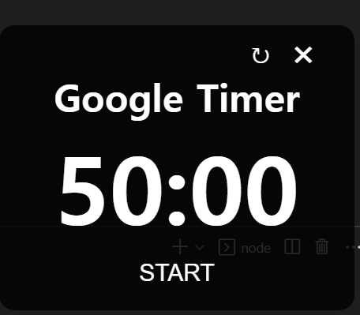
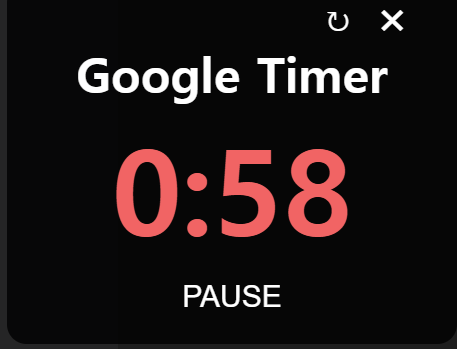
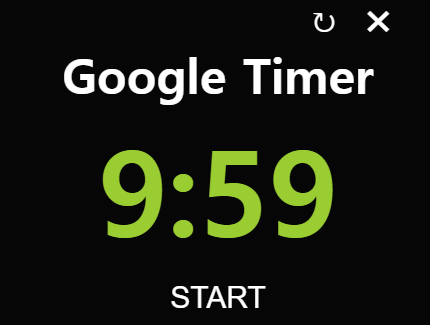

# Google Timer

## 설치방법
1. node 설치
2. electron 설치
    npm install electron --save-dev
3. 실행
    npm run start

### 특징
커스텀 toolbar을 이용해 UX를 높였습니다.
항상 제일 위에 표시하도록 해 타이머를 놓치는 일 막았습니다.
휴식 시간 및 시간 임박에 따른 색을 달리 표시해 UX를 강화했습니다.

### 이미지

평시 | 시간임박 | 휴식시간
---|---|---|
|  | 